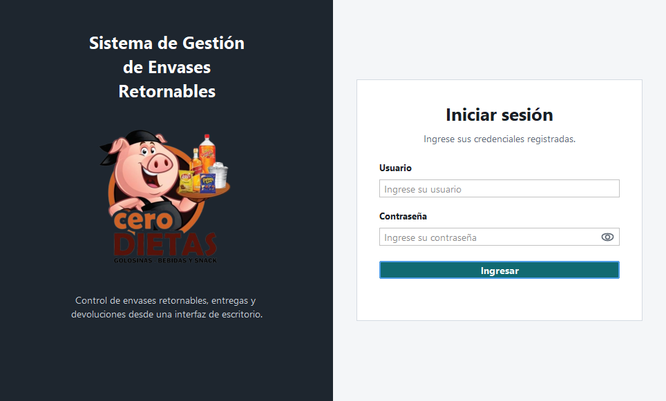
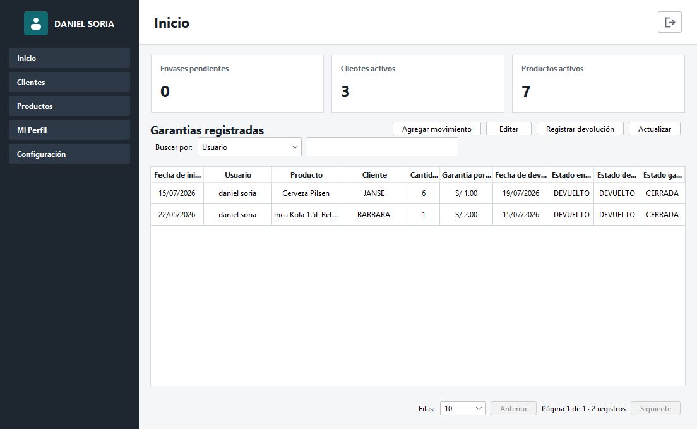
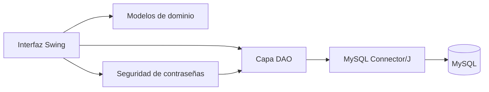

<div align="center">
  
  <h1>Sistema de Gestión de Envases Retornables</h1>
  <p>Aplicación de escritorio para controlar entregas, garantías y devoluciones de envases en Cero Dietas.</p>

  <p>
    
    
    
    
  </p>
</div>

## Descripción

Este proyecto académico digitaliza el control de envases retornables entregados a clientes. Registra el producto, el cliente, la cantidad de envases, el depósito de garantía y las devoluciones parciales o completas. De esta manera se conserva la trazabilidad de cada movimiento y se reduce el control manual.

El sistema utiliza una interfaz de escritorio desarrollada con Java Swing, una arquitectura separada por responsabilidades y una base de datos MySQL con restricciones de integridad.

## Capturas

### Inicio de sesión



### Dashboard principal



## Funcionalidades

- Autenticación de usuarios activos.
- Dashboard con indicadores de envases pendientes, saldo de garantías por devolver y productos activos.
- Módulo independiente para crear garantías y consultar el detalle completo de cada movimiento.
- Registro y edición de clientes.
- Registro y edición de productos.
- Desactivación lógica de clientes y productos para conservar su historial.
- Registro y edición de garantías por envases entregados.
- Devoluciones parciales y completas de envases y depósitos.
- Cálculo de cantidades pendientes y montos devueltos.
- Búsqueda por diferentes criterios en las tablas principales.
- Paginación configurable de 5, 10, 25 o 50 registros.
- Perfil personal con actualización de datos, contraseña y color de avatar.
- Administración de usuarios y roles.
- Restricción del módulo Configuración al nivel administrador.

## Roles y permisos

| Nivel | Acceso |
|---|---|
| Administrador | Operación completa del sistema, creación y edición de usuarios y administración de roles. |
| Empleado | Operación de garantías, clientes, productos y su propio perfil. No puede acceder a Configuración. |

El acceso administrativo se valida tanto en la interfaz como en la capa de datos. Ocultar el menú no es la única medida de protección: cada operación administrativa vuelve a verificar el nivel del usuario en MySQL.

## Arquitectura



El código está organizado en las siguientes capas:

```text
src/main/java/com/sistemagarantia/
├── app/          Punto de entrada de la aplicación
├── dao/          Consultas y transacciones con MySQL
├── database/     Configuración de la conexión JDBC
├── model/        Entidades y objetos de transferencia
├── security/     Protección y validación de contraseñas
└── ui/           Ventanas, paneles y componentes Swing
```

## Modelo de datos

| Tabla | Responsabilidad |
|---|---|
| `tb_persona` | Datos personales asociados a una cuenta. |
| `tb_usuario` | Credenciales, estado y preferencias del usuario. |
| `tb_rol` | Roles y nivel administrativo. |
| `tb_cliente` | Clientes que reciben envases retornables. |
| `tb_producto` | Productos asociados a los envases. |
| `tb_garantia` | Entregas, cantidades, depósitos y estados. |
| `tb_devolucion_garantia` | Historial de devoluciones parciales o completas. |

La base incluye claves foráneas, restricciones `CHECK`, nombres de usuario únicos y estados controlados mediante `ENUM`.

## Tecnologías

- Java 21
- Java Swing
- FlatLaf 3.5.4
- Maven
- MySQL Connector/J 9.0.0
- MySQL 8 o superior
- IntelliJ IDEA

## Requisitos

- JDK 21.
- MySQL Server 8 o superior.
- Maven 3.9 o el Maven integrado de IntelliJ IDEA.
- Puerto MySQL `3306` disponible.

## Instalación en la tienda

El paquete de distribución se genera en `D:\INSTALADOR_SISTEMA_ENVASES`. En la computadora de la tienda:

1. Ejecute `INSTALAR_SISTEMA_ENVASES_V2.exe` desde el USB.
2. Acepte la solicitud de permisos de administrador.
3. Espere a que el instalador cree el acceso directo e inicie la aplicación.
4. Ingrese con `admin` / `Admin123*` y cambie la contraseña desde **Mi Perfil**.

El instalador incluye Java, MySQL y sus componentes requeridos. Crea el servicio local aislado `CeroDietasMySQL` en el puerto `3307`, sin reemplazar otras instalaciones de MySQL. Las credenciales internas de la base de datos se generan aleatoriamente durante la instalación y no se guardan en el USB.

## Instalación para desarrollo

### 1. Clonar o abrir el proyecto

```bash
git clone <URL_DEL_REPOSITORIO>
cd SistemaCredito
```

También puede abrirse directamente desde IntelliJ IDEA seleccionando el archivo `pom.xml`.

### 2. Crear la base de datos

Para una instalación nueva, ejecute:

```bash
mysql -u root -p < database/schema.sql
```

El script crea la base `sistemagarantia`, todas sus tablas, los roles iniciales y una cuenta administrativa de demostración.

| Usuario inicial | Contraseña inicial |
|---|---|
| `admin` | `Admin123*` |

Cambie esta contraseña desde **Mi Perfil** después del primer inicio de sesión.

Los archivos de `database/migrations/` representan la evolución incremental de una base existente. No deben ejecutarse después de `schema.sql`, porque el esquema nuevo ya incluye esos cambios.

### 3. Configurar MySQL

Actualice el usuario y la contraseña de conexión en:

```text
src/main/java/com/sistemagarantia/database/Conexion.java
```

La base configurada por el proyecto debe conservar el nombre `sistemagarantia`.

### 4. Compilar y verificar

```bash
mvn clean test
```

La compilación usa Java 21 y activa `-Xlint:all` para detectar advertencias del compilador.

### 5. Ejecutar

Desde IntelliJ IDEA, ejecute:

```text
com.sistemagarantia.app.Main
```

## Seguridad e integridad

- Las contraseñas nuevas se almacenan con PBKDF2-HMAC-SHA256, sal aleatoria y 120 000 iteraciones.
- Las contraseñas antiguas se migran al formato protegido después de una autenticación correcta.
- Los usuarios y roles inactivos no obtienen acceso.
- El administrador no puede desactivar su propia sesión ni retirarse su propio nivel administrativo.
- Las operaciones relacionadas con garantías y devoluciones utilizan transacciones.
- Las eliminaciones de clientes y productos son lógicas para no perder trazabilidad.
- Las consultas utilizan `PreparedStatement` para parametrizar los valores enviados a MySQL.

## Estado del proyecto

El sistema se encuentra funcional como prototipo académico: compila sin advertencias con Java 21, dispone de navegación modular, control de acceso, persistencia en MySQL y flujos completos de entrega y devolución.

Como mejoras futuras se consideran:

- Incorporar pruebas unitarias y de integración automatizadas.
- Mover las credenciales de MySQL a variables de entorno.
- Generar reportes exportables en PDF o Excel.
- Crear un instalador para equipos que no utilicen IntelliJ IDEA.
- Añadir auditoría detallada de cambios administrativos.

## Alcance académico

El proyecto demuestra aplicación de programación orientada a objetos, interfaces gráficas, JDBC, bases de datos relacionales, transacciones, control de acceso por roles, validación de datos y organización modular del código.
